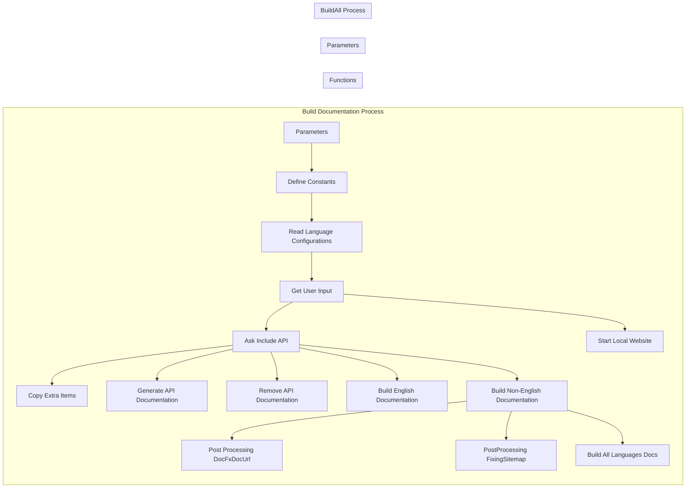
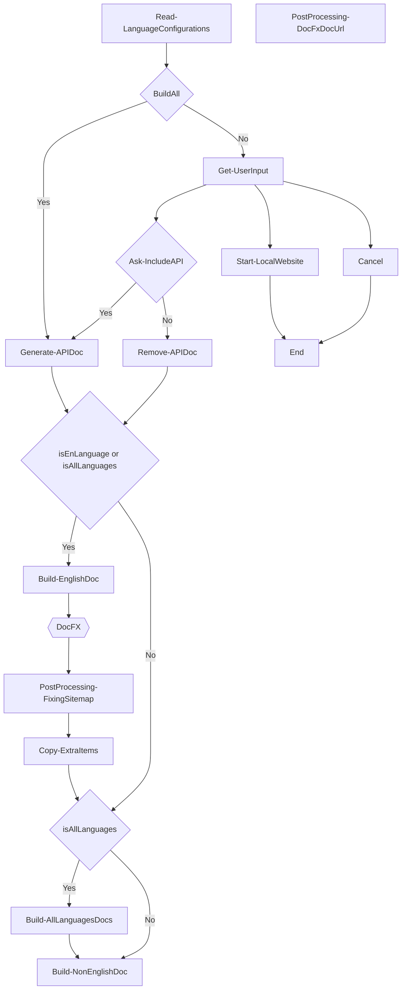

# Stride Docs Development

* [Getting Started](#getting-started)
* [Contributing](#contributing)
* [.NET Foundation](#net-foundation)
* [License](#license)
<!--* [Roadmap](#roadmap)-->

## 🚀 Getting Started

Welcome to the Stride documentation repository. This repository contains all the source files for the Stride documentation (http://doc.stride3d.net/). 

Anyone is welcome to contribute! Before you start, please take the time to read the [guidelines](GUIDELINES.md). 

You can find basic information about editing the documentation in [Getting Started](GETTINGSTARTED.md) dedicated page.

Happy editing!

- Building 1620 file(s) in ResourceDocumentProcessor(ValidateResourceMetadata)...
- Building 304 file(s) in ConceptualDocumentProcessor(BuildConceptualDocument=>CountWord=>ValidateConceptualDocumentMetadata)...
- Building 2133 file(s) in ManagedReferenceDocumentProcessor(BuildManagedReferenceDocument=>SplitClassPageToMemberLevel=>ValidateManagedReferenceDocumentMetadata=>ApplyOverwriteDocumentForMref=>FillReferenceInformation)...
- Building 6 file(s) in TocDocumentProcessor(BuildTocDocument)...
- Applying templates to 4063 model(s)...

---

- Building 2516 file(s) in ManagedReferenceDocumentProcessor(BuildManagedReferenceDocument=>SplitClassPageToMemberLevel=>ValidateManagedReferenceDocumentMetadata=>ApplyOverwriteDocumentForMref=>FillReferenceInformation)...
- Applying templates to 4446 model(s)...


### Manage multiple Stride versions

Each Stride minor version (i.e. 4.0, 4.1, etc.) should have its own branch, named in the fashion `master-<version>`. The only exception is latest version, which should be `master`.

Don't forget to change `$version` in [deploy.ps1](build/deploy.ps1) when branching before first deployment.

<!--All the information you need to get started with Stride Website development can be found in the 📚 [Stride Docs Wiki](https://github.com/VaclavElias/stride-docs-next/wiki).-->

## 🤝 Contributing

Use [Discord](https://discord.gg/f6aerfE) for questions and general discussions. 
Use [Issues](https://github.com/stride3d/stride-docs/issues) to report bugs and proposing features.

We welcome code contributions through pull requests. Issues tagged as **[`help-wanted`](https://github.com/stride3d/stride-website/labels/help-wanted)** are good candidates for starting to contribute code.

### Branch and Release

The `master` branch is the default branch for pull requests and most other development activities. 

Releases are based on a stable `master` branch. Use of [Conventional Commit](https://www.conventionalcommits.org/en/v1.0.0/) is encouraged.

Stride Docs website is _not_ released under a regular cadence; new updates arrive when maintainers fix issues or see enough changes that warrant a new releases. Sometimes we use prereleases to get feedbacks from the community.

<!--
## 🗺️ Roadmap

Our Wiki [Roadmap](https://github.com/VaclavElias/stride-website-next/wiki/Roadmap) communicates upcoming changes to the Stride Docs.-->

## 🌐 .NET Foundation

This project is supported by the [.NET Foundation](http://www.dotnetfoundation.org).

This project has adopted the code of conduct defined by the [Contributor Covenant](http://contributor-covenant.org/) to clarify expected behavior in our community.
For more information see the [.NET Foundation Code of Conduct](http://www.dotnetfoundation.org/code-of-conduct).

## License

This project is licensed under the [MIT](https://github.com/VaclavElias/stride-website-next/blob/main/LICENSE.md) License.

# Docs

## Installation

Prerequisites:

- Familiarity with the command line
- Install .NET SDK 6.0 (link) or higher

Make sure you have .NET SDK installed, then open a terminal and enter the following command to install the latest docfx:

```
dotnet tool install -g docfx
```

Or check the inslalled version is at least `2.66.0`

```
docfx --version
```

**Other options**

Update to the latest docfx

```
dotnet tool update -g docfx
```

Install a specific version of docfx

```
dotnet tool update -g docfx --version 2.66.0
```

## Build

Go to `stride-docs` folder

run

```
run.bat
```

- en and jp docs only, without API - 3 minutes

 ## Post-Release Features

 - Dark Theme by Default





