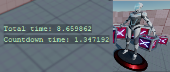
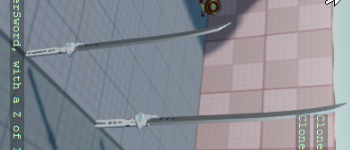
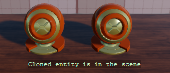
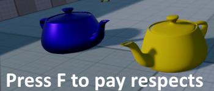
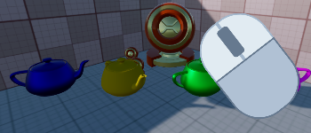
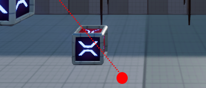
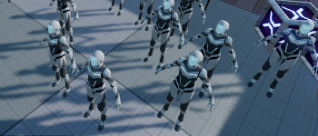
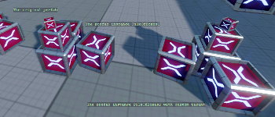

# C# Beginner 🌱

These tutorials cover the beginner principles of using C# when working with the Stride game engine. Start here if you are new to Stride.

Note: These tutorials do not serve as an introduction to C# itself. While having some coding experience is helpful, it is not mandatory to get started with these tutorials.

You can create the C# beginner tutorial project by starting the Stride launcher. Create a new project and select the template: **Tutorials** -> **C# beginner**. Each scene is loaded as a child scene and demonstrates a sample script.

## YouTube Tutorial Series

All tutorials are accompanied by a YouTube video. You can watch the entire C# Beginners playlist here.

> [!Video https://www.youtube.com/embed/videoseries?list=PLRZx2y7uC8mNySUMfOQf-TLNVnnHkLfPi]

## All tutorials

    

        

            
            

                <h2 class="card-title h5">Introduction</h2>
                
Learn about the C# beginners project template, how entities and components work, different types of scripts, and more.

            

            
📺 Watch the <a class="astretched-link" href="introduction.md">Introduction</a> tutorial

        

    

    

        

            
            

                <h2 class="card-title h5">Getting the Entity</h2>
                
Learn how to retrieve the entity, retrieve the parent entity, print debug text, and more.

            

            
📺 Watch the <a class="astretched-link" href="entity.md">Getting the Entity</a> tutorial

        

    

    

        

            
            

                <h2 class="card-title h5">Child entities</h2>
                
Learn how to get a specific child entity, retrieve children in a list, and access children of children.

            

            
📺 Watch the <a class="astretched-link" href="child-entities.md">Child entities</a> tutorial

        

    

    

        

            
            

                <h2 class="card-title h5">The transform</h2>
                
Learn how to access the Transform component, get the local position, and get the world position.

            

            
📺 Watch the <a class="astretched-link" href="transform-position.md">transform</a> tutorial

        

    

    

        

            
            

                <h2 class="card-title h5">Editor properties</h2>
                
Discover how to define various editor properties, create lists, and hide public properties.

            

            
📺 Watch the <a class="astretched-link" href="editor-properties.md">Editor properties</a> tutorial

        

    

    

        

            
            

                <h2 class="card-title h5">Getting a component</h2>
                
Understand how to get a component, remove a component, and access methods of other components.

            

            
📺 Watch the <a class="astretched-link" href="get-component.md">Getting a component</a> tutorial

        

    

    

        

            
            

                <h2 class="card-title h5">Adding a component</h2>
                
Explore adding a component, removing all components of one type, and creating a component if it doesn't exist.

            

            
📺 Watch the <a class="astretched-link" href="add-component.md">Adding a component</a> tutorial

        

    

 
    [
    

       <h2>Delta time</h2>
    

    

        
    

    

        <ul>
            <li>Retrieving delta time</li> 
            <li>Making a simple timer</li> 
            <li>Making a simple countdown timer</li> 
        </ul>
    

    ](delta-time.md) 

    [
    

       <h2>Cloning an entity</h2>
    

    

        
    

    

        <ul>
            <li>Cloning an entity</li> 
            <li>Adding an entity to the current scene</li> 
            <li>Adding an entity as a child to a parent entity</li> 
        </ul>
    

    ](cloning-entities.md) 

    [
    

       <h2>Removing an entity</h2>
    

    

           
    

    

        <ul>
            <li>Cloning new entities using a timer</li> 
            <li>Removing entities using a timer</li> 
            <li>Removing an entity from the scene</li> 
        </ul>
    

    ](removing-entities.md) 

 
    [
    

       <h2>Keyboard input</h2>
    

    

         
    

    

        <ul>
            <li>Holding down a key</li> 
            <li>Clicking a key</li> 
            <li>Releasing a key</li> 
        </ul>
    

    ](keyboard-input.md) 

    [
    

       <h2>Mouse input</h2>
    

    
 
        
    

    

        <ul>
            <li>Holding down a mouse button</li> 
            <li>Clicking or releasing a mouse button</li> 
            
            <li>Using the mouse wheel </li> 
        </ul>
    

    ](mouse-input.md) 

    [
    

       <h2>Virtual buttons</h2>
    

    

        
    

    

        <ul>
            <li>Defining a virtual key configuration</li> 
            <li>Binding input to the configuration</li> 
            <li>Using the virtual buttons</li> 
        </ul>
    

    ](virtual-buttons.md) 

 
    [
    

       <h2>Linear Interpolation</h2>
    

    

         
    

    

        <ul>
            <li>Calculating 'lerp' value</li> 
            <li>Lerp between vector 3</li> 
            <li>Random values</li> 
        </ul>
    

    ](linear-interpolation.md) 

 
    [
    

       <h2>Loading content</h2>
    

    

         
    

    

        <ul>
            <li>Loading content from code</li> 
            <li>Unloading content</li> 
            <li>Attach models to entities</li> 
        </ul>
    

    ](loading-content.md) 

 
    [
    

       <h2>Instantiating prefabs</h2>
    

    

         
    

    

        <ul>
            <li>Instantiate prefab</li> 
            <li>Load prefab from content</li> 
            <li>Parent prefab entity</li> 
        </ul>
    

    ](instantiating-prefabs.md) 

