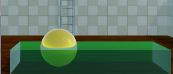
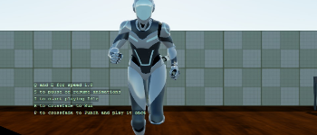
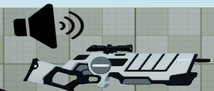
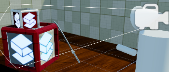
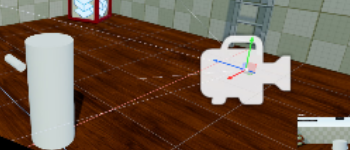

# C# Intermediate 🎓
These tutorials cover various intermediate principles of using C# when working with the Stride game engine.

It is recommended that you complete all the [C# Beginner tutorials](../csharpbeginner/index.md) before moving on to the intermediate tutorials.

To create the C# intermediate tutorial project:

1. Start the Stride launcher
1. Create a new project
1. Select the template: Tutorials -> C# intermediate

Each tutorial has a 'Start' and a 'Completed' scene.

You can view the Completed scenes to see what the end result of each tutorial will roughly look like. If you are following along with the videos, the Start scenes serve as a good starting point. These scenes contain only the bare minimum setup. 

## Stride C# intermediate YouTube tutorial series

> [!Video https://www.youtube.com/embed/videoseries?list=PLRZx2y7uC8mOE6_L0ZiFxNBE7HmzU2dP7]

# All tutorials

    

        

            
            

                <h2 class="card-title h5">Introduction</h2>
                
A brief introduction to the C# intermediate tutorials for the Stride game engine.

            

            
📺 Watch the <a class="astretched-link" href="introduction.md">Introduction</a> tutorial

        

    

    

        

            
            

                <h2 class="card-title h5">UI Basics</h2>
                
Learn about the UI editor, hooking up events, and creating UI by code.

            

            
📺 Watch the <a class="astretched-link" href="ui-basics.md">UI Basics</a> tutorial

        

    

    

        

            
            

                <h2 class="card-title h5">Collision triggers</h2>
                
Explore colliders, trigger events, and colliding entities.

            

            
📺 Watch the <a class="astretched-link" href="collision-triggers.md">Collision triggers</a> tutorial

        

    

    

        

            
            

                <h2 class="card-title h5">Raycasting</h2>
                
Understand raycasting, collision groups, and penetrative raycasting..

            

            
📺 Watch the <a class="astretched-link" href="raycasting.md">Raycasting</a> tutorial

        

    

 
    [
    

       <h2>Project and Unproject</h2>
    

    

          
    

    

        <ul>
            <li>Projecting</li> 
            <li>Unprojecting</li> 
            <li>Viewports</li> 
        </ul>
    

    ](project-and-unproject.md) 

    [
    

       <h2>Async scripts</h2>
    

    
   
        
    

    

        <ul>
            <li>Asynchronous scripts</li> 
            <li>Async collision triggers</li> 
            <li>Async web api</li> 
        </ul>
    

    ](async-scripts.md) 

    [
    

       <h2>Scenes</h2>
    

    

        
    

    

        <ul>
            <li>Child scenes</li> 
            <li>Removing a scene</li> 
            <li>(Re)loading a scene</li> 
        </ul>
    

    ](scenes.md) 

 
    [
    

       <h2>Animation basics</h2>
    

    

        
    

    

        <ul>
            <li>Animation clips</li> 
            <li>Play and pause</li> 
            <li>Cross fade</li> 
        </ul>
    

    ](animation-basics.md) 

    [
    

       <h2>Audio</h2>
    

    

        
    

    

        <ul>
            <li>Sounds and music</li> 
            <li>Spatialized sound</li> 
            <li>Streaming music</li> 
        </ul>
    

    ](audio.md) 

    [
    

       <h2>First person camera</h2>
    

    

           
    

    

        <ul>
            <li>Mouse movement</li> 
            <li>Applying rotation</li> 
            <li>Limited camera angles</li> 
        </ul>
    

    ](first-person-camera.md) 

    [
    

       <h2>Third person camera</h2>
    

    

           
    

    

        <ul>
            <li>Third person offset</li> 
            <li>Wall clamping</li> 
            <li>First person fallback</li> 
        </ul>
    

    ](third-person-camera.md) 

    [
    

       <h2>Navigation</h2>
    

    
 
        
    

    

        <ul>
            <li>Navigation meshes</li> 
            <li>Navigation settings</li> 
            <li>Pathfinding</li> 
        </ul>
    

    ](navigation.md) 

